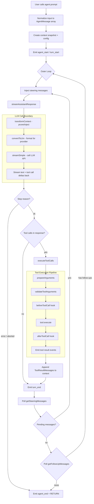

# Coder - Implementation Plan

Reference architecture based on [badlogic/pi-mono](https://github.com/badlogic/pi-mono/).

## 1. The Agentic Loop

The core loop lives in [`packages/agent/src/agent-loop.ts`](https://github.com/badlogic/pi-mono/blob/main/packages/agent/src/agent-loop.ts) — specifically the `runLoop()` function. The [`Agent`](https://github.com/badlogic/pi-mono/blob/main/packages/agent/src/agent.ts) class wraps it with state management, event dispatch, and message queues.

### Two-Loop Design

The loop uses a **nested two-loop** architecture:

- **Inner loop**: keeps iterating as long as the LLM returns tool calls or there are pending steering messages (mid-run user input).
- **Outer loop**: after the inner loop settles, checks for follow-up messages. If any exist, it re-enters the inner loop. Otherwise, the agent stops.



### Stop Conditions

1. **Natural completion** - no tool calls AND no pending/follow-up messages.
2. **LLM error** - the provider returned an error.
3. **Abort signal** - user called `agent.abort()`.

### Steering vs Follow-Up Queues

| Queue | Injected When | Purpose |
|-------|---------------|---------|
| `agent.steer(msg)` | During a run, before next LLM call | Mid-run user input (e.g. user typing while agent works) |
| `agent.followUp(msg)` | After agent would otherwise stop | Re-enters outer loop for additional work |

Both use [`PendingMessageQueue`](https://github.com/badlogic/pi-mono/blob/main/packages/agent/src/agent.ts) with configurable drain modes: `"all"` or `"one-at-a-time"`.

### Message Conversion Boundary

Messages stay in `AgentMessage[]` format throughout the loop. Only at the LLM call boundary are they converted to provider-specific formats via `convertToLlm()`. This lets apps embed custom message types (artifacts, notifications) in the transcript without confusing the LLM.

---

## 2. Prompts

### System Prompt Assembly

Source: [`packages/coding-agent/src/core/system-prompt.ts`](https://github.com/badlogic/pi-mono/blob/main/packages/coding-agent/src/core/system-prompt.ts)

The system prompt is assembled from layered sources in this order:

1. **Base prompt** - default (see below) OR a custom `.pi/SYSTEM.md` that replaces it entirely.
2. **Project context** - `AGENTS.md` / `CLAUDE.md` files walked from cwd to root + global `~/.pi/agent/`.
3. **Skills index** - XML block listing available skills with name, description, and file location.
4. **Append block** - `.pi/APPEND_SYSTEM.md` content (if present).
5. **Date + CWD** - appended last.

Loading logic: [`agent-session.ts`](https://github.com/badlogic/pi-mono/blob/main/packages/coding-agent/src/core/agent-session.ts), [`resource-loader.ts`](https://github.com/badlogic/pi-mono/blob/main/packages/coding-agent/src/core/resource-loader.ts)

### Default Base Prompt

```
You are an expert coding assistant operating inside pi, a coding agent harness.
You help users by reading files, executing commands, editing code, and writing new files.

Available tools:
- read: Read file contents
- bash: Execute bash commands (ls, grep, find, etc.)
- edit: Make precise file edits with exact text replacement, including multiple disjoint edits in one call
- write: Create or overwrite files

Guidelines:
- Use bash for file operations like ls, rg, find
- Use read to examine files instead of cat or sed.
- Use edit for precise changes (edits[].oldText must match exactly)
- When changing multiple separate locations in one file, use one edit call with multiple entries
  in edits[] instead of multiple edit calls
- Each edits[].oldText is matched against the original file, not after earlier edits are applied.
  Do not emit overlapping or nested edits. Merge nearby changes into one edit.
- Keep edits[].oldText as small as possible while still being unique in the file.
- Use write only for new files or complete rewrites.
- Be concise in your responses
- Show file paths clearly when working with files
```

Guidelines are **dynamic** - they change based on which tools are registered. If `grep`/`find`/`ls` tools are active alongside `bash`, the guideline becomes: *"Prefer grep/find/ls tools over bash for file exploration (faster, respects .gitignore)."*

### Override Mechanism

| File | Effect |
|------|--------|
| `.pi/SYSTEM.md` | **Replaces** the entire default base prompt |
| `.pi/APPEND_SYSTEM.md` | **Appends** to whatever base prompt is active |
| Extensions | Can modify the prompt per-turn via `session_start` events |

---

## 3. Tools

Source: [`packages/coding-agent/src/core/tools/`](https://github.com/badlogic/pi-mono/tree/main/packages/coding-agent/src/core/tools)

Each tool contributes three things to the prompt:
- **`description`** - sent as the tool schema description to the LLM API.
- **`promptSnippet`** - one-liner shown in the system prompt's tools list.
- **`promptGuidelines`** - usage rules injected into the guidelines section.

### read

- **Description**: Read the contents of a file. Supports text files and images (jpg, png, gif, webp). Images are sent as attachments. Output truncated to 500 lines or 32KB. Use offset/limit for large files.
- **Schema**: `path` (string), `offset` (optional, 1-indexed), `limit` (optional)
- **Guideline**: Use read to examine files instead of cat or sed.

### bash

- **Description**: Execute a bash command in the current working directory. Returns stdout and stderr. Output truncated to last 500 lines or 32KB. If truncated, full output saved to temp file.
- **Schema**: `command` (string), `timeout` (optional, seconds)

### edit

- **Description**: Edit a single file using exact text replacement. Every `edits[].oldText` must match a unique, non-overlapping region of the original file.
- **Schema**: `path` (string), `edits[]` array of `{oldText, newText}`
- **Guidelines**:
  - `edits[].oldText` must match exactly
  - Use one edit call with multiple entries for multiple locations in the same file
  - Each `oldText` is matched against the original file, not after earlier edits
  - Keep `oldText` as small as possible while still unique

### write

- **Description**: Write content to a file. Creates if not exists, overwrites if it does. Auto-creates parent directories.
- **Schema**: `path` (string), `content` (string)
- **Guideline**: Use only for new files or complete rewrites.

### grep

- **Description**: Search file contents for a pattern. Returns matching lines with file paths and line numbers. Respects .gitignore. Truncated to 100 matches or 32KB.
- **Schema**: `pattern` (string), `path` (optional), `include` (optional glob)

### find

- **Description**: Search for files by glob pattern. Returns matching file paths relative to search directory. Respects .gitignore. Truncated to 1000 results or 32KB.
- **Schema**: `pattern` (string), `path` (optional)

### ls

- **Description**: List directory contents. Sorted alphabetically, `/` suffix for directories. Includes dotfiles. Truncated to 500 entries or 32KB.
- **Schema**: `path` (optional)

---

## 4. Compaction / Summarization

Source: [`packages/coding-agent/src/core/compaction/`](https://github.com/badlogic/pi-mono/tree/main/packages/coding-agent/src/core/compaction)

When the context window fills, pi compacts using structured summarization. All variants produce the same format: **Goal > Constraints > Progress (Done/In Progress/Blocked) > Key Decisions > Next Steps > Critical Context**.

| Prompt | When Used |
|--------|-----------|
| `SUMMARIZATION_PROMPT` | Initial compaction - full conversation to checkpoint |
| `UPDATE_SUMMARIZATION_PROMPT` | Incremental - merge new messages into existing summary |
| `TURN_PREFIX_SUMMARIZATION_PROMPT` | Single oversized turn - summarize prefix, keep recent suffix |
| `BRANCH_SUMMARY_PROMPT` | Summarize a conversation branch before switching away |

---

## 5. Subagent Personas (Example Extension)

Source: [`packages/coding-agent/examples/extensions/subagent/agents/`](https://github.com/badlogic/pi-mono/tree/main/packages/coding-agent/examples/extensions/subagent/agents)

| Agent | Model | Tools | Role |
|-------|-------|-------|------|
| Scout | haiku-4.5 | read, bash, grep, find, ls | Fast recon, outputs structured findings for handoff |
| Planner | sonnet-4.5 | read, bash (read-only), grep, find, ls | Analysis, produces numbered implementation plans |
| Worker | sonnet-4.5 | all | Implements tasks, outputs completion report |
| Reviewer | sonnet-4.5 | read, bash (read-only), grep, find, ls | Code review, outputs structured feedback |

Chain workflows: `scout > plan`, `scout > plan > implement`, `implement > review > apply feedback`.

---

## 6. Prompt Templates (Slash Commands)

Source: [`.pi/prompts/`](https://github.com/badlogic/pi-mono/tree/main/.pi/prompts)

| Command | Purpose |
|---------|---------|
| `/cl` | Changelog audit before release |
| `/is` | GitHub issue analysis (bugs/features) |
| `/pr` | PR review with structured output |
| `/wr` | Wrap current task (changelog, commit, push) |

These use `$ARGUMENTS` / `$@` for argument substitution and are loaded on demand.
