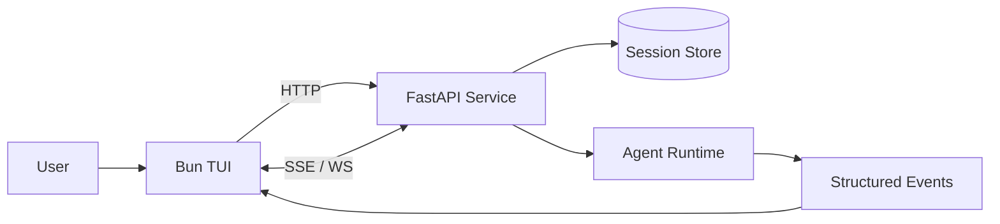

# Bun TUI + Python Agent Service Design

Date: 2026-04-15

## Summary

This design splits the current Python coding agent into two cooperating processes:

- **Bun TUI**: the terminal UI, input handling, session picker, and streaming renderer.
- **Python FastAPI service**: the authoritative agent runtime, session persistence layer, and event stream producer.

The goal is to keep the agent logic reusable while giving the user a modern terminal interface with live updates. The Bun client remains intentionally thin: it renders state, sends user input, and listens to streamed events. The Python service owns conversation state, agent execution, tool calls, and durable persistence.

The recommended transport is **HTTP for control requests** plus **SSE or WebSocket for streaming**. This keeps the protocol simple while still supporting rich incremental UI updates.

---

## Goals

- Provide a Bun-based terminal UI for the existing Python agent.
- Keep Python as the source of truth for session and transcript state.
- Support live streaming of assistant text, tool activity, and errors.
- Allow a single active session that can be resumed later from disk.
- Keep the design small enough for a first version without overengineering.

## Non-Goals

- Multi-user access control.
- Remote hosting or authentication.
- Complex session branching or concurrent conversations.
- Replacing the agent runtime itself with Bun.

---

## Architecture

### High-Level Components

- **Bun TUI**
  - Terminal rendering
  - User input capture
  - Session selection / resume UI
  - Stream consumption and incremental redraws
  - Lightweight local preferences only

- **Python FastAPI Service**
  - Session creation and loading
  - Agent orchestration
  - Tool execution
  - Persistent transcript and status storage
  - Streaming event emission to the TUI

### Process Boundary

The Bun app never calls tools directly and never mutates the authoritative transcript. Instead, it sends user messages to the Python service, which appends them to the session, runs the agent loop, and streams structured events back to the client.

---

## Runtime Flow

1. The user launches the Bun TUI.
2. The TUI asks the Python service for the most recent session, or creates a new one if none exists.
3. The user enters a message.
4. The Bun client sends the message to the Python service over HTTP.
5. The Python service stores the user message, starts the agent loop, and begins streaming events.
6. The Bun UI renders assistant text chunks, tool lifecycle events, and status changes as they arrive.
7. When the run completes, Python persists the final transcript and session status.
8. On later startup, the Bun TUI can resume the last session by asking Python for it.

This flow gives the user a responsive UI without making the client responsible for any durable state.

---

## API and Event Model

The service should expose a small API surface:

- `POST /sessions` — create a session or resume a new one
- `GET /sessions/{id}` — fetch session metadata and transcript
- `POST /sessions/{id}/messages` — submit a user message and start a run
- `POST /sessions/{id}/cancel` — cancel the active run
- `GET /sessions/{id}/stream` or `WS /sessions/{id}/stream` — stream live events

### Suggested Event Types

The stream should emit structured events rather than raw text alone:

- `session.created`
- `message.user_added`
- `assistant.delta`
- `tool.started`
- `tool.stdout`
- `tool.result`
- `tool.failed`
- `assistant.completed`
- `session.error`
- `session.cancelled`

This makes the TUI capable of showing progress, tool activity, and partial output without guessing at internal state.

---

## Persistence Model

Python should own persistence and be the source of truth for session state. For a first version, a **JSON-per-session** storage format is a good fit because it is easy to inspect and debug.

Each stored session should include:

- session id
- creation timestamp
- last updated timestamp
- current status (`idle`, `running`, `cancelled`, `error`)
- transcript messages
- optional metadata such as current working directory or project root

If the app grows, the persistence layer can move to SQLite without changing the Bun-facing contract much. The key requirement is that the Bun client should not need to understand storage details.

---

## Error Handling and Cancellation

Error handling should preserve partial progress.

- If the Python service is unreachable, the Bun TUI should show a clear offline state and a retry affordance.
- If a run fails before streaming begins, the client should receive a single error event and keep the session usable.
- If a failure occurs mid-stream, the UI should preserve already received content and append an error marker.
- If the user cancels a run, the Bun client should call the cancel endpoint and Python should stop the agent cleanly.

Cancellation should be a first-class session state rather than an implicit socket disconnect. Python should persist both the transcript and the final status so resuming later is accurate.

---

## Implementation Shape

A practical repository layout would be:

- `python/` or the existing Python package root for the FastAPI service
- `tui/` for the Bun application
- `docs/` for shared protocol notes and design docs

The Python service should be implemented first because it defines the contract. Once the endpoints and event shapes are stable, the Bun TUI can be built against them with minimal churn.

---

## Testing Strategy

### Python Service Tests

- session creation and loading
- persistence round trips
- event emission order
- cancellation behavior
- API response shapes

### Protocol Tests

- confirm Bun and Python agree on endpoint payloads and event names
- validate that streamed events are parseable and ordered

### Bun TUI Smoke Tests

- connect to the Python service
- create or resume a session
- submit a message
- render streamed assistant output
- surface a service error state cleanly

The first version does not need exhaustive UI automation; a handful of smoke tests is enough to verify the boundary.

---

## Recommended First Milestone

Build the Python FastAPI service first with the following scope:

1. session create/load endpoints
2. message submit endpoint
3. streaming event channel
4. JSON session persistence
5. cancellation endpoint

Then implement the Bun TUI as a client of that service. This sequence reduces ambiguity and keeps the UI simple.
